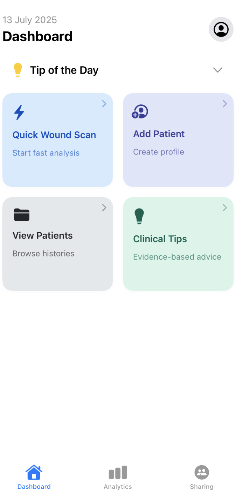
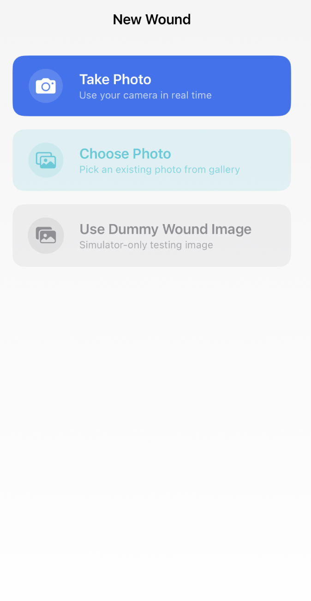
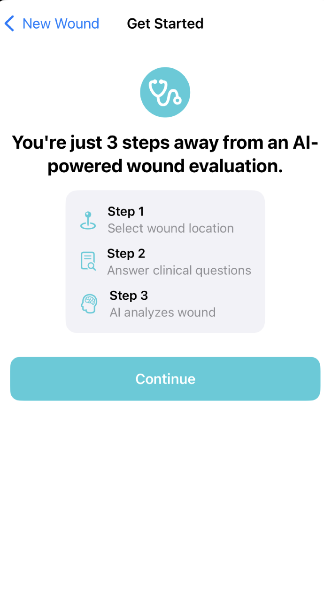
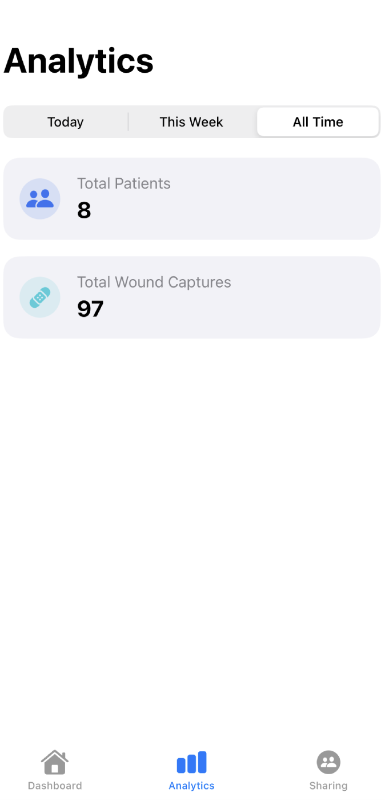
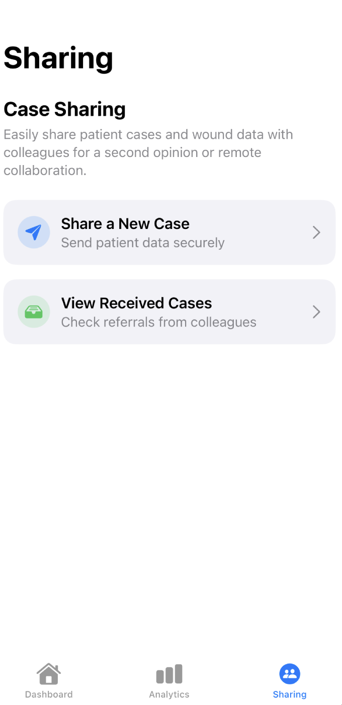
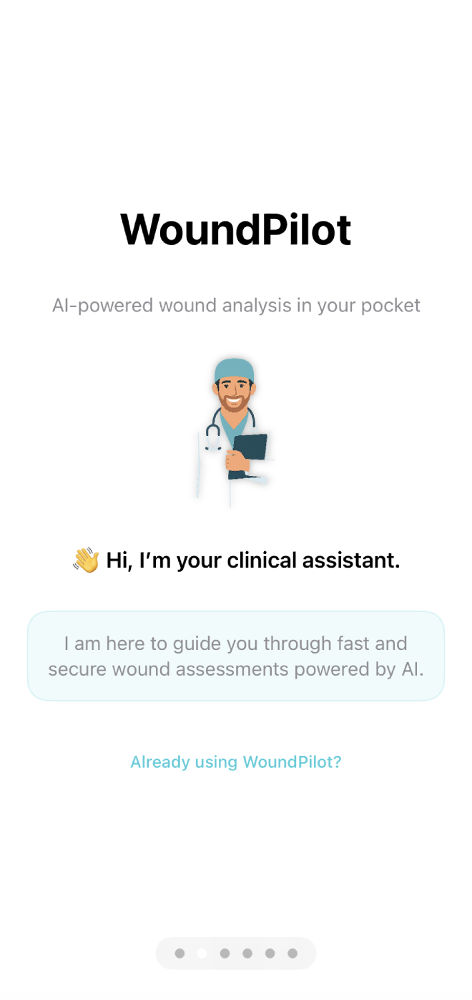

# WoundPilot – Smart Wound Analysis for Clinicians  
*A modern AI-powered wound care assistant, built with SwiftUI and Firebase.*

---

## 🧭 Overview

**WoundPilot** is a clinically-focused iOS app designed to help healthcare professionals capture, document, and analyze chronic wounds using AI and CoreML (coming soon). Built with a secure Firebase backend and a polished SwiftUI interface, WoundPilot aims to modernize wound tracking and simplify digital documentation for doctors in the field or in the clinic.

> ⚠️ Currently under active development

---

## ✨ Key Features

- 📸 **Wound Photo Capture** – Take or upload high-resolution images of wounds  
- 🧠 **AI-Powered Analysis** (coming soon) – Automated wound stage and type detection via CoreML  
- 🔒 **Secure Login & Authentication** – Firebase Auth with email & password login  
- 🧾 **Wound History by Patient** – View, group, and track healing over time  
- 📍 **Wound Location Mapping** – Select body region using interactive diagram  
- 📊 **Healing Graphs** – Visualize wound progress over time  
- ⚙️ **Firebase Firestore & Storage** – Secure cloud-based storage of wound data and images
- 🌐 **Multilingual Support** – English and Slovak language options (UI localization)  

---

## 📸 Screenshots



*Main dashboard with fast access to scanning, patient management, and clinical tips.*



*Flexible image input: real-time camera, photo library, or dummy wound image.*


*Interactive anatomical diagram for selecting precise wound regions.*



*Simple 3-step guide before starting AI-powered wound evaluation.*



*Analytics showing total patients and wound captures across time ranges.*



*Secure sharing and referrals for clinician-to-clinician collaboration.*



*Friendly clinical assistant welcoming users with secure onboarding.*

## 🧠 AI Analysis (Coming Soon)

WoundPilot will integrate a custom CoreML model trained on wound image datasets to provide:

- Wound type classification (e.g., pressure ulcer, diabetic ulcer)  
- Stage detection (e.g., necrotic, granulating, epithelizing)  
- Etiology suggestions and possible differential diagnoses  
- Healing trend predictions based on previous images  

This feature is currently under development with a custom training pipeline using CoreML and real clinical image data.

---

## 🔧 Tech Stack

| Layer        | Tools/Frameworks                           |
|--------------|---------------------------------------------|
| **Frontend** | SwiftUI, Combine                           |
| **Backend**  | Firebase Authentication, Firestore, Storage |
| **AI**       | CoreML (planned), Vision, Custom Model      |
| **UI Design**| SF Symbols, Swift Charts                    |

---

## 🗂 Project Structure (simplified)

```
WoundPilot/
├── Views/
│   ├── HomeView.swift
│   ├── CaptureWoundView.swift
│   ├── WoundListView.swift
│   ├── QuestionnaireView.swift
│   └── ...
├── Services/
│   ├── FirebaseService.swift
│   ├── WoundService.swift
│   └── ...
├── Models/
│   ├── Wound.swift
│   └── Patient.swift
├── Utilities/
│   └── ImagePicker.swift
└── WoundPilotApp.swift
```

---

## 🚀 Getting Started

### Requirements

- macOS (Monterey or later)  
- Xcode 15+  
- Firebase account + configured iOS app  
- Swift 5.9+  

### Installation

1. Clone the repository:

```bash
git clone https://github.com/yourusername/WoundPilot.git
cd WoundPilot
```

2. Open `WoundPilot.xcodeproj` in Xcode.

3. Configure Firebase:
   - Download your `GoogleService-Info.plist`
   - Add it to the Xcode project root

4. Build & run on iOS Simulator or device

---

## 🔐 Privacy & Security

WoundPilot stores all sensitive data using Firebase with the following practices:

- ✅ **Authentication** via secure Firebase Auth  
- ✅ **No local storage of medical images** (stored only in Firebase Storage)  
- ✅ **Realtime Firestore database rules** restrict access to user-owned data  
- ✅ **No 3rd-party analytics or tracking** included  
- ✅ **HIPAA compliance goals** in progress (AI and data processing plans aligned)  

---

## 🛣 Roadmap

- [x] Basic patient and wound capture flow  
- [x] Secure login and Firestore integration  
- [x] Body location picker  
- [x] Healing graph (Swift Charts)  
- [ ] AI size and general wound analysis via CoreML  
- [ ] Questionnaire scoring and risk classification  
- [ ] TestFlight release  
- [ ] Localization: Full Slovak + English language support

---

## 👨‍💻 Author

**[@agatalangova17](https://github.com/agatalangova17)**  
Aspiring mobile developer, passionate about clinical technology, privacy, and human-centered design.

---

## 📨 Contact

Feel free to reach out if you're interested in collaboration, internships, or feedback!

📧 Email: agata.langova17@gmail.com
🌐 GitHub: [github.com/agatalangova17](https://github.com/agatalangova17)

---

## 📄 License

© 2025 WoundPilot. All rights reserved.

This project is intended for educational and portfolio use only.  
Do not reproduce, redistribute, or deploy without permission.
